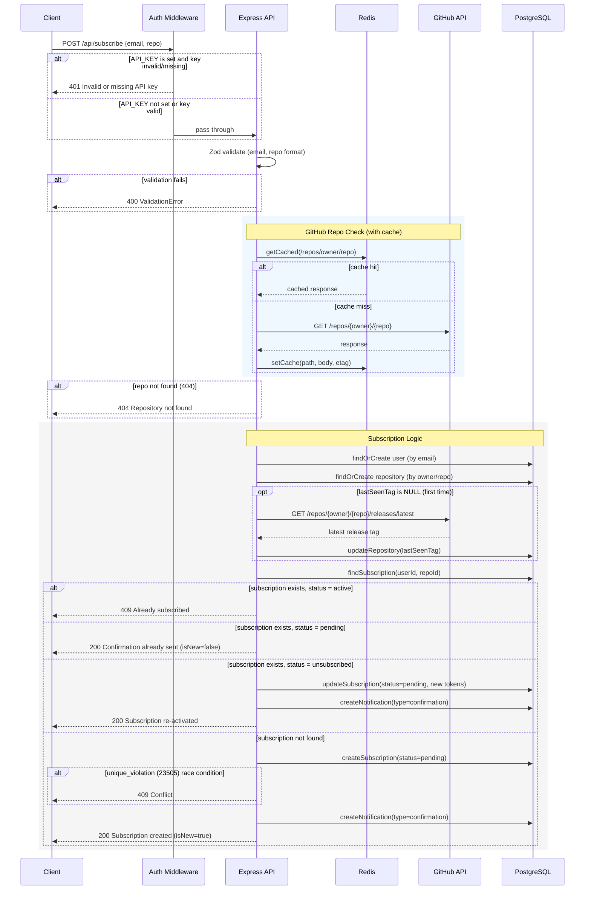
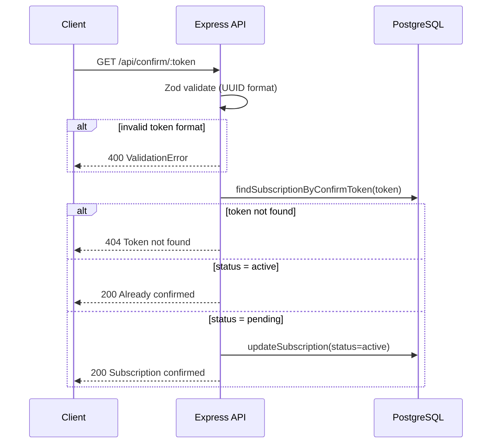
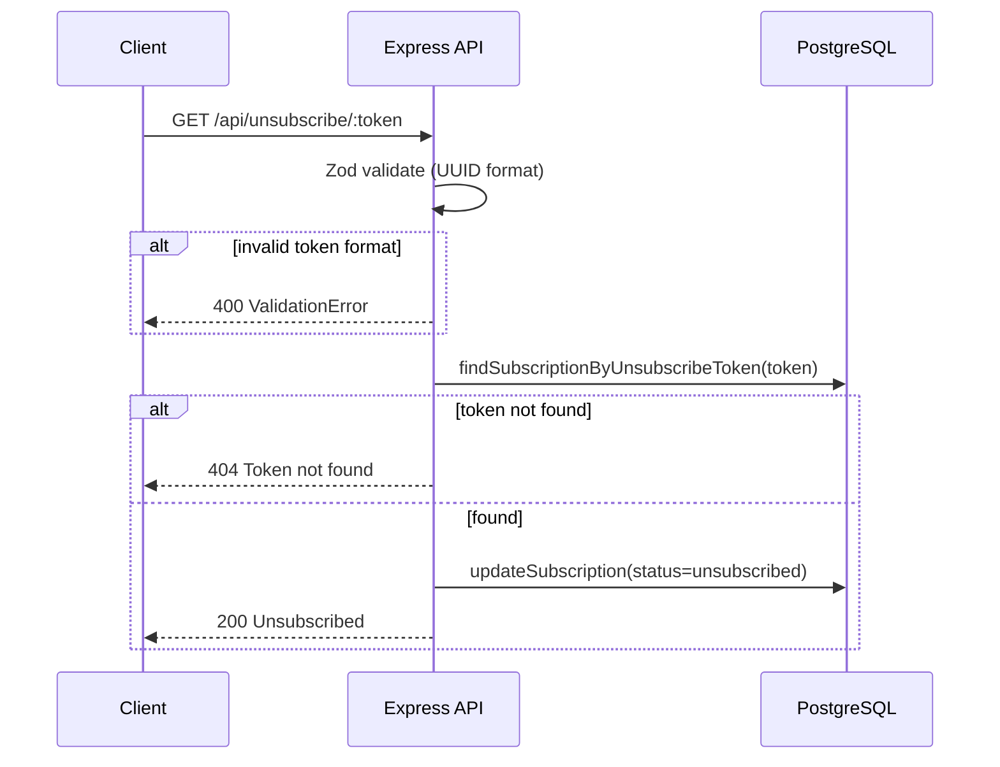
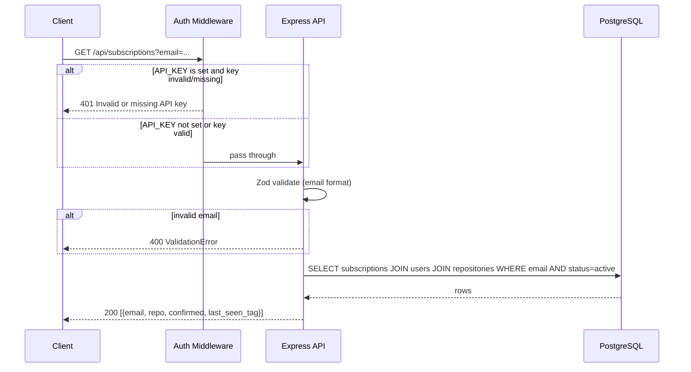
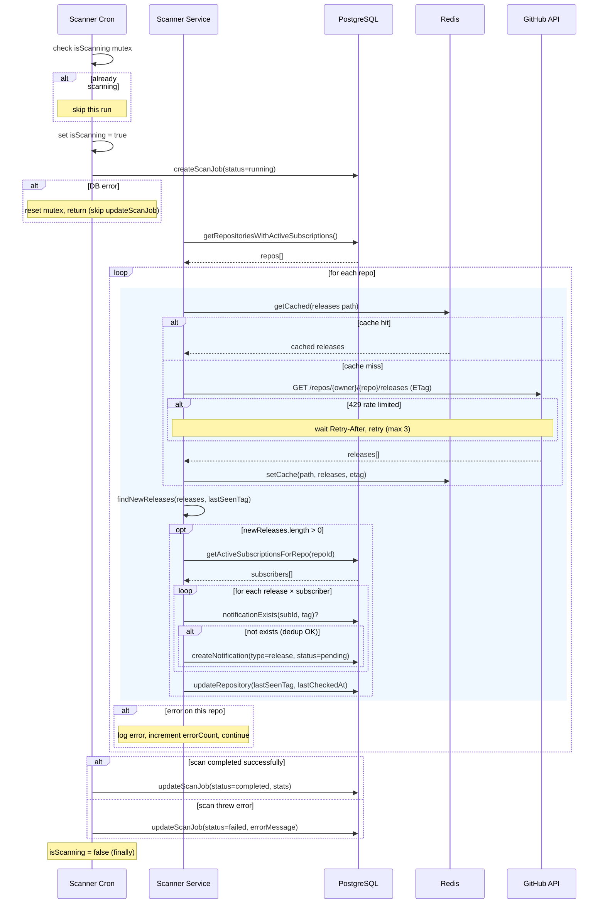
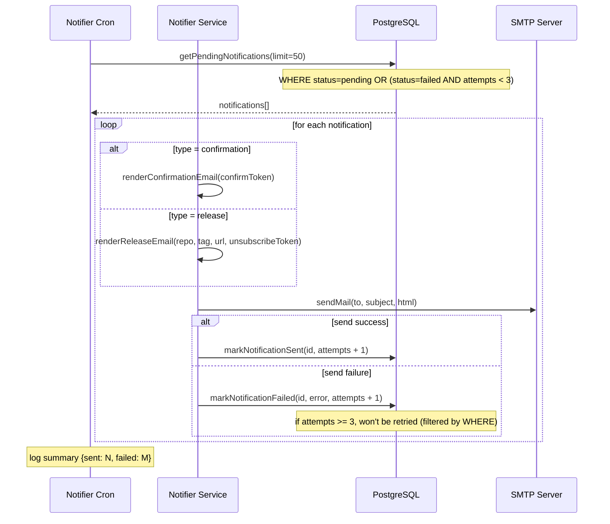

# SDD: System Design Document

**Author:** Ivan Hryshko
**Date:** 2026-04-11
**Status:** Implemented

---

## 1. System Overview

GitHub Release Notificator is a monolithic Node.js service. One process handles three responsibilities:

| Module | Trigger | Job |
|--------|---------|-----|
| **API** | HTTP request | Manage subscriptions (subscribe, confirm, unsubscribe, list) |
| **Scanner** | Cron (every 5 min) | Check GitHub for new releases, create notification records |
| **Notifier** | Cron (every 1 min) | Send pending emails, retry failures (max 3 attempts) |

```
  Browser / curl
       │
       ▼
 ┌───────────┐      ┌──────────┐
 │  Express   │─────▶│ Postgres │
 │  (API)     │      └──────────┘
 └───────────┘            ▲
       │                  │
 ┌───────────┐      ┌─────┴────┐      ┌───────┐
 │  Scanner   │─────▶│ GitHub   │◀────▶│ Redis │
 │  (cron)    │      │ API      │      │ cache │
 └───────────┘      └──────────┘      └───────┘
       │
 ┌───────────┐      ┌──────────┐
 │  Notifier  │─────▶│  SMTP    │
 │  (cron)    │      │(Mailtrap)│
 └───────────┘      └──────────┘
```

## 2. Database Schema

5 tables, defined in `src/db/schema.ts`. Migrations auto-run on startup via Drizzle.

### Entity Relationships

```
users 1 ──── N subscriptions N ──── 1 repositories
                   │
                   └──── N notifications

scan_jobs (independent — logs each scanner run)
```

### Tables

**users** — one email = one user

| Column | Type | Notes |
|--------|------|-------|
| id | SERIAL PK | |
| email | VARCHAR(255) | UNIQUE index |

**repositories** — tracked GitHub repos, deduplicated

| Column | Type | Notes |
|--------|------|-------|
| id | SERIAL PK | |
| owner | VARCHAR(255) | |
| repo | VARCHAR(255) | UNIQUE(owner, repo) |
| last_seen_tag | VARCHAR(255) | NULL = never scanned |
| last_checked_at | TIMESTAMP | |

Key design: `last_seen_tag` is per-repo, not per-subscription. If 500 users follow `facebook/react`, we store the tag once and make one GitHub API call.

**subscriptions** — links users to repos

| Column | Type | Notes |
|--------|------|-------|
| id | SERIAL PK | |
| user_id | FK → users | |
| repository_id | FK → repositories | UNIQUE(user_id, repository_id) |
| status | VARCHAR(20) | `pending` → `active` → `unsubscribed` |
| confirm_token | VARCHAR(64) | UUID, indexed |
| unsubscribe_token | VARCHAR(64) | UUID, indexed |

Why `status` instead of `confirmed: boolean` — three-state lifecycle can't be expressed with a boolean.

**notifications** — each email to send/sent/failed

| Column | Type | Notes |
|--------|------|-------|
| id | SERIAL PK | |
| subscription_id | FK → subscriptions | |
| type | VARCHAR(20) | `confirmation` or `release` |
| release_tag | VARCHAR(255) | for type=release |
| status | VARCHAR(20) | `pending` → `sent` / `failed` |
| attempts | INT | max 3 |
| error_message | TEXT | reason for failure |

**scan_jobs** — audit log for each scanner run

| Column | Type | Notes |
|--------|------|-------|
| status | VARCHAR(20) | `running` / `completed` / `failed` |
| repos_checked | INT | |
| releases_found | INT | |
| notifications_created | INT | |

## 3. Data Flows

> **Diagram conventions:** solid arrows (`->>`) = requests, dashed arrows (`-->>`) = responses. `alt` = branching logic (if/else), `opt` = optional step, `loop` = iteration. See [Mermaid docs](https://mermaid.js.org/syntax/sequenceDiagram.html) for syntax reference.

### 3.1 Subscribe Flow (POST /api/subscribe)

```
POST /api/subscribe { email, repo: "owner/repo" }
  │
  ├─ Zod validation (email format, repo regex)
  ├─ GitHub API: does repo exist? (cached via Redis)
  ├─ Upsert user + repository in DB
  ├─ Seed last_seen_tag with latest release (prevents notifying about current release)
  ├─ Check existing subscription:
  │    active      → 409 Conflict
  │    pending     → return 200 (resend confirmation)
  │    unsubscribed → reset to pending, new tokens
  │    not found   → create new subscription
  ├─ Create confirmation notification (type='confirmation', status='pending')
  └─ Return 200
```

Confirmation emails are **not sent inline** — they go through the same notification pipeline as release emails. This ensures automatic retries and non-blocking API responses. See [ADR-004](adr/ADR-004-async-confirmation-emails.md).

#### Sequence Diagram



### 3.2 Confirm Flow (GET /api/confirm/:token)

```
GET /api/confirm/:token
  │
  ├─ Zod validation (UUID format)
  ├─ Find subscription by confirm_token
  │    not found → 404
  │    already active → 200 (no update)
  │    pending → update status to active → 200
  └─ Return 200
```

#### Sequence Diagram



### 3.3 Unsubscribe Flow (GET /api/unsubscribe/:token)

```
GET /api/unsubscribe/:token
  │
  ├─ Zod validation (UUID format)
  ├─ Find subscription by unsubscribe_token
  │    not found → 404
  │    found → update status to unsubscribed → 200
  └─ Return 200
```

#### Sequence Diagram



### 3.4 List Subscriptions (GET /api/subscriptions?email=)

```
GET /api/subscriptions?email=user@example.com
  │
  ├─ API key authentication (X-API-Key header)
  ├─ Zod validation (email format)
  ├─ Query active subscriptions with JOIN (users + subscriptions + repositories)
  └─ Return 200 [{email, repo, confirmed, last_seen_tag}]
```

#### Sequence Diagram



### 3.5 Scanner Flow (every 5 min)

```
cron trigger
  │
  ├─ Mutex check (skip if already running)
  ├─ Create scan_job record (status=running)
  ├─ Get repos with active subscriptions
  ├─ For each repo:
  │    ├─ Fetch releases from GitHub (with Redis cache + ETag)
  │    ├─ Compare with last_seen_tag using findNewReleases()
  │    ├─ For each new release × each active subscriber:
  │    │    └─ Create notification record (with dedup check)
  │    └─ Update last_seen_tag to newest release
  └─ Update scan_job (completed/failed + counters)
```

`findNewReleases()` logic — GitHub returns releases newest-first:
- No releases → `[]`
- No `last_seen_tag` (first scan) → `[releases[0]]` (only latest)
- `last_seen_tag` found at index N → `releases.slice(0, N)` (all newer ones)
- `last_seen_tag` not in list → `[releases[0]]` (conservative: only latest)

#### Sequence Diagram



### 3.6 Notifier Flow (every 1 min)

```
cron trigger
  │
  ├─ SELECT 50 pending/failed notifications (attempts < 3)
  ├─ For each:
  │    ├─ Dispatch by type:
  │    │    confirmation → confirmationEmail(confirmToken)
  │    │    release      → releaseNotificationEmail(repo, tag, ...)
  │    ├─ Send via Nodemailer
  │    ├─ Success → mark sent
  │    └─ Failure → mark failed, increment attempts
  └─ Log: sent N, failed M
```

All outgoing emails (confirmations and release alerts) flow through this unified pipeline, ensuring retries and a complete audit trail.

#### Sequence Diagram



## 4. GitHub API Strategy

Problem: GitHub rate limits — 60 req/hr without token, 5000 with token.

Multi-layer approach:

| Layer | How | Effect |
|-------|-----|--------|
| **PAT token** | `GITHUB_TOKEN` env var | 60 → 5000 req/hr |
| **Redis cache** | Promise-guarded async singleton (TTL configurable, default 600s) | Repeat requests skip API |
| **ETag / If-None-Match** | Conditional requests | 304 responses don't count against limit |
| **Header tracking** | Read `X-RateLimit-Remaining` | Pause when remaining < 10 |
| **429 handling** | Read `Retry-After`, sleep, retry (max 3) | Graceful recovery |

Implementation in `src/github/github.client.ts` — `githubFetch()` wraps all requests with cache check → rate limit wait → conditional request → retry logic. The 429 retry loop is capped at 3 attempts to prevent infinite recursion under persistent rate limiting.

`fetchLatestRelease()` uses the dedicated `/releases/latest` endpoint instead of `fetchReleases(perPage=1)`. This avoids a filtering bug where `per_page=1` could return a draft/prerelease, which after client-side filtering would produce an empty result and cause false "new release" notifications on the next scan.

## 5. Error Handling

Custom error classes in `src/common/errors.ts`:

| Error | HTTP | When |
|-------|------|------|
| `ValidationError` | 400 | Bad input (Zod validation) |
| `NotFoundError` | 404 | Repo not found, token not found |
| `ConflictError` | 409 | Already subscribed |
| `AppError` | any | Base class |

Global error handler catches all — known errors return structured JSON, unknown errors return 500 and log the stack trace.

To ensure API idempotency and handle concurrent subscription attempts, the service catches PostgreSQL `23505` (unique_violation) errors during subscription creation. Instead of a generic 500, the API returns a structured 409 Conflict response. This handles the race condition where two concurrent requests for the same email+repo both pass the existence check but one fails on the unique constraint.

Scanner isolates errors per-repo: if one repo fails, others continue scanning. The scanner cron guards against DB failures — if `createScanJob()` fails (e.g., DB is down), the catch block skips `updateScanJob()` and the `isScanning` mutex resets cleanly.

## 6. Security

- **API key authentication** — `X-API-Key` header on `POST /subscribe` and `GET /subscriptions`. Single admin key from `API_KEY` env var. When not set, auth is disabled. Confirm/unsubscribe endpoints are unprotected (accessed via email links with UUID tokens). API key comparison uses `crypto.timingSafeEqual` to prevent timing attacks. See [ADR-002](adr/ADR-002-api-key-auth.md).
- **HTML escaping** — All user-controlled and GitHub-sourced data (`repo`, `tagName`, `releaseName`, `releaseUrl`) is escaped via `escapeHtml()` before interpolation into email HTML templates, preventing XSS in email clients.
- **Double opt-in** — subscription activates only after clicking UUID confirmation link
- **Stateless unsubscribe** — each subscription has a unique `unsubscribe_token` in every email
- **Token entropy** — `crypto.randomUUID()` = 122 bits, brute force not feasible
- **Redis connection safety** — `getRedis()` uses a Promise-guarded async singleton pattern to prevent race conditions during connection. No caller receives an instance until `connect()` resolves. See [ADR-005](adr/ADR-005-redis-singleton-initialization.md).
- **Infrastructure** — Postgres and Redis ports not exposed outside Docker network
- **Firewall** — only ports 22 (SSH) and 80 (HTTP) open on production server

## 7. Infrastructure

### Docker (multi-stage build)

```dockerfile
# Stage 1: build TypeScript
FROM node:20-alpine AS builder
RUN npm ci && npm run build  # tsc → dist/

# Stage 2: production image (no dev deps, no source)
FROM node:20-alpine
COPY dist/, node_modules/, package.json
COPY public/, swagger/, migrations/  # non-TS assets
CMD ["node", "dist/server.js"]
```

### Production (docker-compose.yml)

| Service | Image | Ports |
|---------|-------|-------|
| app | custom build | 80:3000 (public) |
| postgres | postgres:16-alpine | internal only |
| redis | redis:7-alpine | internal only |

### Startup Sequence

```
server.ts
  ├─ runMigrations()     ← Drizzle auto-migrates
  ├─ startScannerCron()  ← every 5 min
  ├─ startNotifierCron() ← every 1 min
  ├─ app.listen(3000)
  └─ SIGTERM/SIGINT → graceful shutdown (close server, pool, redis)
```

## 8. Configuration

All config via environment variables, validated at startup with Zod (`src/config/env.ts`). If validation fails, the app crashes immediately with a clear error message — no silent defaults for required values.

| Variable | Default | Purpose |
|----------|---------|---------|
| `DATABASE_URL` | required | PostgreSQL connection |
| `REDIS_URL` | `redis://localhost:6379` | Redis cache |
| `GITHUB_TOKEN` | optional | GitHub API auth (5000 req/hr) |
| `SMTP_HOST/PORT/USER/PASS` | Mailtrap defaults | Email delivery |
| `SCAN_INTERVAL` | `*/5 * * * *` | Scanner cron schedule |
| `NOTIFY_INTERVAL` | `*/1 * * * *` | Notifier cron schedule |
| `NOTIFY_MAX_ATTEMPTS` | 3 | Max email retry attempts |
| `GITHUB_CACHE_TTL` | 600 | Redis cache TTL in seconds |

## 9. Testing Strategy

| Layer | Tool | What's tested |
|-------|------|---------------|
| Unit tests | Vitest | All services (subscription, scanner, notifier, github client) |
| Integration tests | Vitest + Postgres/Redis in CI | Full flow with real DB |
| CI | GitHub Actions | Lint + unit tests on every push |

Unit tests mock external dependencies (DB, GitHub API, SMTP). Key pattern: `vi.hoisted()` for shared mocks, `vi.resetModules()` + dynamic import for module-level state reset.
